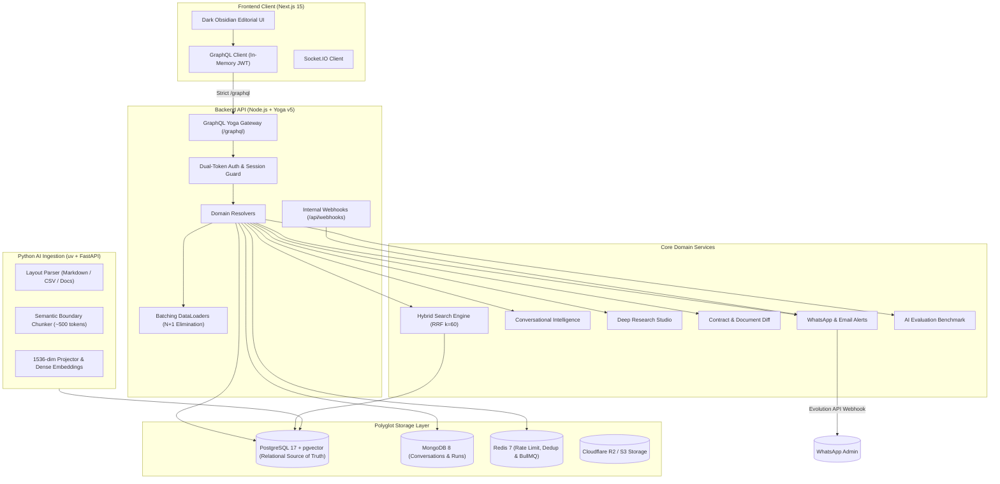

# KURIPP — AI Knowledge & Research Platform

> **A production-quality, portfolio-grade AI full-stack workspace engineered for document intelligence, hybrid vector search (RRF $k=60$), deep research synthesis, grounded citation attribution, and proactive alerting.**

[](https://opensource.org/licenses/MIT)
[](https://the-guild.dev/graphql/yoga-server)
[](https://github.com/pgvector/pgvector)
[](https://www.mongodb.com/)
[](https://redis.io/)
[](https://nextjs.org/)
[](https://astral.sh/uv)
[](https://github.com/Jay-Raam/KURIPP/actions)

---

## Start Here (5-Minute Code Review)

If you are evaluating KURIPP for technical depth, security architecture, and AI retrieval rigor, review these core files:

| Dimension | File / Directory | What to Inspect |
| :--- | :--- | :--- |
| **Hybrid Search (RRF $k=60$)** | [`apps/api/src/search/search.service.ts`](apps/api/src/search/search.service.ts) | Reciprocal Rank Fusion combining dense 1536-dim vector embeddings with BM25 lexical token matching in a single query |
| **Zero-Storage Auth Guard** | [`apps/api/src/auth/auth.middleware.ts`](apps/api/src/auth/auth.middleware.ts) | In-memory JWT access tokens + HttpOnly session rotation (RTR) with zero browser persistent storage exposure |
| **Deep Research Decomposition** | [`apps/api/src/research/research.service.ts`](apps/api/src/research/research.service.ts) | Autonomous multi-angle query decomposition and cross-document evidence synthesis pipeline |
| **AI Evaluation Benchmark** | [`apps/api/src/evaluation/evaluation.service.ts`](apps/api/src/evaluation/evaluation.service.ts) | Automated evaluation test harness asserting Groundedness ($\ge 90\%$) and Hallucination Index |
| **Document Intelligence Engine** | [`services/ai/`](services/ai/) | High-throughput Python 3.11+ `uv` FastAPI layout parser and semantic boundary chunker |

---

## 1. Overview & Vision

**KURIPP** is a personal and team knowledge workspace designed from the ground up for strict security, rigorous document intelligence, and grounded AI synthesis.

Rather than acting as a superficial wrapper around an LLM chat endpoint, KURIPP demonstrates enterprise full-stack software engineering:
- **Strict Public API Protocol**: 100% GraphQL at `/graphql` powered by Express.js and GraphQL Yoga v5 with request-scoped DataLoaders preventing N+1 queries.
- **Zero Browser Sensitive Storage**: In-memory JWT access tokens and HttpOnly, SameSite, Secure refresh cookies with automatic session rotation (RTR) and token family reuse detection. Zero tokens in `localStorage`, `sessionStorage`, or `IndexedDB`.
- **Hybrid Multi-Database Architecture**:
  - **PostgreSQL 17 + pgvector**: Relational truth, organizations, workspaces, RBAC, documents, document chunks, 1536-dim embeddings, collections, research notes, diffs, reports, and audit logs.
  - **MongoDB 8**: Chat sessions, conversational message turns, tool execution history, and run telemetry.
  - **Redis 7**: Cache, rate limiting, distributed locks, and 15-minute alert deduplication fingerprints.
  - **Cloudflare R2 / S3**: Presigned direct-to-storage upload and streaming downloads with 50MB limits and format verification.
- **Single-Query Hybrid Search (RRF $k=60$)**: Reciprocal Rank Fusion fusing dense 1536-dimensional cosine vector distance with BM25 lexical token scoring, strictly isolated by tenant/workspace.
- **Deep Research Studio**: Autonomous multi-angle query decomposition, multi-pass hybrid retrieval passes, cross-document evidence synthesis, and 1-click export to Markdown Research Notes.
- **Semantic Document & Contract Diff**: Clause-level segmentation identifying `ADDED`, `REMOVED`, `MODIFIED` (e.g. Net 30 to Net 60, liability caps 12x to 24x), and `UNCHANGED` provisions with AI commercial and risk impact analysis.
- **AI Evaluation Benchmark**: Automated harness evaluating retrieval quality against benchmark cases, asserting **Groundedness ($\ge 90\%$)**, Citation Precision, and Hallucination Index.
- **Proactive WhatsApp & Email Alerting**: Evolution API integration with automatic payload sanitization (purging JWTs, passwords, and API keys), Redis deduplication (15m cooldown window), and webhook callbacks for delivery/read receipts (`whatsapp_messages` audit table).

---

## 2. System Architecture



---

## Key Engineering Decisions & Trade-Offs

| Decision | Why It Was Made | Alternative Considered & Why Rejected |
| :--- | :--- | :--- |
| **Hybrid Search via RRF ($k=60$) over Vector-Only** | Pure vector embeddings suffer from semantic drift on specific keywords, acronyms, and product codes (e.g. "REV-2026-X"). Reciprocal Rank Fusion ($k=60$) perfectly fuses dense cosine similarity with BM25 lexical token match. | Standalone vector DB (Pinecone/Weaviate). Rejected because PostgreSQL 17 with `pgvector` co-locates relational ACID permissions, workspace filters, and vector embeddings in a single atomic query with zero network hop latency. |
| **In-Memory JWT Access Tokens & HttpOnly Refresh Cookies** | Completely prevents Cross-Site Scripting (XSS) credential theft. Tokens never touch `localStorage`, `sessionStorage`, or `IndexedDB`. | Storing JWTs in `localStorage`. Rejected because any XSS vulnerability or malicious browser extension could exfiltrate bearer credentials. |
| **Strict GraphQL Yoga Gateway with AST Depth Limiting** | Eliminates multiple REST endpoint sprawl and prevents Denial of Service (DoS) attacks via nested circular query exploitation. AST complexity budgets enforce pagination and depth <= 12. | RESTful API controllers. Rejected because deep research graph traversals across documents, citations, and workspaces require precise field selection without over-fetching. |
| **Polyglot Persistence (Postgres + Mongo + Redis)** | PostgreSQL stores canonical relational entities and vectors; MongoDB stores variable-length multi-turn LLM reasoning traces; Redis provides sub-millisecond deduplication and rate-limiting. | Forcing all workloads into a single database. Rejected because relational schemas degrade under massive polymorphic JSON LLM transcripts, while pure NoSQL databases lack strict foreign keys for RBAC. |

---

## 3. Monorepo Organization

```text
kuripp/
├── apps/
│   ├── web/               # Next.js 15 App Router Frontend (11 Static Routes)
│   │   ├── src/app/(workspace)/
│   │   │   ├── chat/      # 3-Column Conversational Workspace with Citation Drawer
│   │   │   ├── documents/ # Enterprise Document Vault with Live Upload Streaming
│   │   │   ├── research/  # 5-Tab Deep Research Studio, Diff, Collections & Benchmark
│   │   │   └── workspaces/# Workspace Management & RBAC Role Assignment
│   └── api/               # Express + GraphQL Yoga Gateway & Services
│       ├── src/alerts/    # WhatsApp Provider, Deduplication & Webhooks
│       ├── src/collections/# Collections Organization Service
│       ├── src/notes/     # Research Notes Service
│       ├── src/research/  # Deep Research Engine (Query Decomposition & Synthesis)
│       ├── src/tools/     # Document Diff Engine & AI Tool Runner
│       ├── src/evaluation/# AI Groundedness Benchmark Harness
│       └── src/scripts/   # Enterprise Database Seeder
├── services/
│   └── ai/                # Python 3.11+ uv FastAPI Service (Parsing, Chunking, Embeddings)
├── packages/
│   ├── shared-types/      # Canonical TypeScript Models & Interfaces
│   ├── graphql-schema/    # Canonical GraphQL SDL Schema & Definitions
│   ├── eslint-config/     # Strict ESLint Configuration
│   └── tsconfig/          # Shared TypeScript Base Configurations
├── .github/
│   ├── workflows/ci.yml   # Multi-Job Matrix CI Workflow with WhatsApp Failure Alerts
│   └── pull_request_template.md # PR Security & Verification Checklist
├── docs/
│   ├── architecture/      # System Overview & Mermaid Diagrams
│   └── security/          # Threat Model & Cryptographic Boundaries
├── docker-compose.yml     # Local Infrastructure Orchestration
├── pnpm-workspace.yaml    # Monorepo Workspace Definition
└── package.json           # Root Scripts & Turborepo Task Pipeline
```

---

## 4. Quick Start

### Prerequisites
- Node.js >= 20
- pnpm >= 9
- Docker & Docker Compose
- Python >= 3.11 (managed via `uv`)

### 1. Clone & Audit Environment
```bash
git clone https://github.com/Jay-Raam/KURIPP.git
cd KURIPP
pnpm install

# Run the system doctor to audit local dependencies and runtimes
pnpm doctor
```

### 2. Configure Environment
```bash
cp .env.example .env
```

Ensure backend `.env` contains:
```env
OPENROUTER_API_KEY=your_openrouter_api_key_here
ALERT_WHATSAPP_NUMBER=+1234567890
WHATSAPP_API_URL=http://localhost:8080
WHATSAPP_API_KEY=your_evolution_api_key
```

### 3. Start Infrastructure & Run Seeds
```bash
# Start PostgreSQL (pgvector), MongoDB, Redis, Mailpit
docker compose up -d

# Generate Prisma Client & Run Seeder
pnpm --filter @kuripp/api db:generate
pnpm --filter @kuripp/api db:seed
```

Demo Credentials seeded:
- **Email**: `recruiter@kuripp.demo`
- **Password**: `KurippDemo2026!`
*(Also available via 1-Click Demo Sign In button on `/login`)*

### 4. Run Development Services & Smoke Tests
```bash
# Start all microservices in parallel
pnpm dev

# Execute automated architectural smoke test suite
pnpm smoke
```
- **Web App**: `http://localhost:3000` *(Press `Cmd+K` / `Ctrl+K` for global command palette)*
- **GraphQL Yoga API**: `http://localhost:4000/graphql` *(GraphiQL playground enabled)*
- **Mailpit Web UI**: `http://localhost:8025`

---

## 5. Test Suite & Verification Results

| Suite | Runner | Test Count | Status |
| :--- | :--- | :--- | :--- |
| **Monorepo System Doctor** | Node.js ESM | **5 / 5 Audits Clean** | ✅ Green |
| **Architectural Smoke Tests** | Node.js ESM | **7 / 7 Invariants Passing** | ✅ Green |
| **API Test Suite** | Vitest | **44 / 44 Passing** | ✅ Green |
| **Web Security Storage** | Vitest | **2 / 2 Passing** | ✅ Green |
| **Python Ingestion & Embeddings** | Pytest (`uv`) | **7 / 7 Passing** | ✅ Green |
| **Next.js Production Build** | Next.js 15 | **11 / 11 Routes Static** | ✅ Compiled |

---

## 6. Contributing & Community

Please read our [Contributing Guidelines](CONTRIBUTING.md) and [Code of Conduct](CODE_OF_CONDUCT.md) before submitting pull requests.

---

## 7. License
MIT License. Built by Jay Raam as a flagship AI Full Stack portfolio application.
