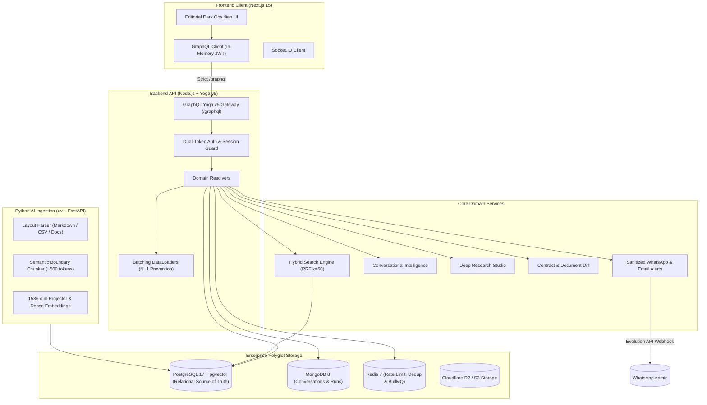
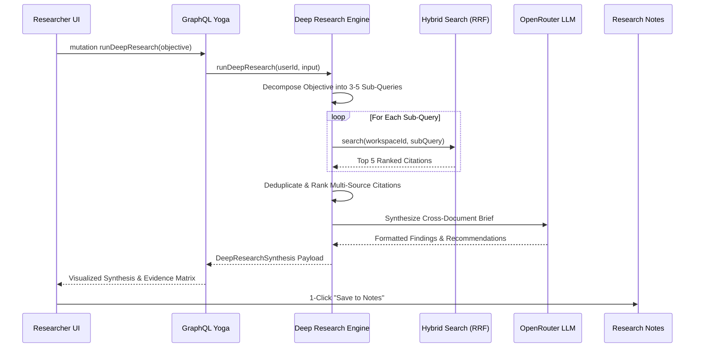

# KURIPP — Architecture & System Overview

KURIPP is a production-grade AI Knowledge, Document Intelligence, and Research Workspace built for rigorous enterprise knowledge cognition.

---

## 1. High-Level System Architecture

---

## 2. Polyglot Storage Strategy

| Database | Role & Responsibilities | Key Entities Stored |
| :--- | :--- | :--- |
| **PostgreSQL 17** | **Relational Source of Truth & Vector Space** | Users, Organizations, Workspaces, Members, Documents, Document Chunks, 1536-dim pgvector Embeddings, Collections, Research Notes, Document Comparisons, Generated Reports, Audit Logs, WhatsApp Message Logs |
| **MongoDB 8** | **Document History & Run Telemetry** | Chat Sessions, Chat Message turns, Token Usage, Tool Execution Logs, Research Runs |
| **Redis 7** | **Ephemeral High-Speed Workloads** | Rate Limiting, Session Family Revocation Cache, Alert Deduplication (15m Cooldown Fingerprints), Distributed Locks |
| **Cloudflare R2 / S3** | **Binary Object Storage** | Presigned streaming uploads for raw PDFs, DOCX, XLSX, PPTX, CSV, and Images |

---

## 3. Hybrid Search & Reciprocal Rank Fusion (RRF)

KURIPP fuses dense vector similarity with BM25 lexical token scoring using single-pass Reciprocal Rank Fusion:

$$RRF(d) = \sum_{m \in M} \frac{1}{k + r_m(d)}$$

Where:
- $k = 60$ (smoothing constant damping outlier ranks)
- $M = \{\text{Cosine Vector Similarity Rank}, \text{BM25 Lexical Score Rank}\}$
- Strictly filtered by `WHERE workspace_id = :workspaceId` to prevent cross-tenant vector leakage.

---

## 4. Multi-Pass Deep Research Workflow

